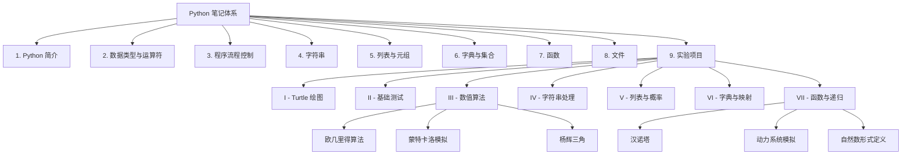

# 🐍 Python 核心笔记 · 数学与算法视角

> **从线性 PPT 到网状知识库,从代码片段到完整实验体系**

[](https://www.python.org/downloads/)
[](https://creativecommons.org/licenses/by-nc-sa/4.0/)
[](https://obsidian.md/)

---

## 📖 关于本仓库

这是一个**由 Python 课程 PPT 重构而来的个人学习笔记库**.原始资料为线性结构的教学课件,本仓库将其重新组织为**网状知识体系**,并在以下三个方面进行了深度扩展:

1. **数学关联**:将 Python 语法与微积分,线性代数,离散数学的概念显式连接
2. **算法思维**:从“怎么写代码”提升到“为什么这样设计算法”
3. **实验闭环**:配套 40+ 可运行代码文件,理论与实践的即时验证

---

## ⚠️ 重要声明

### 关于内容来源
本仓库内容基于校内 Python 课程的教学框架进行**个人化重构与演绎**.所有代码实现,数学关联分析,算法注解和知识结构设计均为**个人学习产出**.

### 关于 AI 辅助生成
本仓库的部分文本(包括但不限于代码注释,章节摘要,数学背景说明)在整理过程中使用了 **AI 辅助工具** 进行润色,结构化和语法修正.**所有内容均经过人工审核与验证**,但仍可能存在以下情况:
- 技术描述不够精确
- 数学符号或公式笔误
- 代码逻辑理解偏差

### 反馈机制
**如发现任何错误,遗漏或可改进之处,欢迎在 Issues 中提出!**
- 提交 Issue 时请附上具体的**文件路径**和**问题描述**
- 如果涉及代码运行问题,请同时提供**输入/输出**和**报错信息**

---

## 📂 仓库结构

```
Python-Notes/
├── Python.md                         # 🧭 总导航(所有章节入口)
│
├── 导航页/                           # 📚 章级笔记(8 章)
│   ├── Python简介.md
│   ├── 数据类型与运算符.md
│   ├── 程序流程控制.md
│   ├── 字符串.md                     # 本章内容全部在这一页
│   ├── 列表与元组.md
│   ├── 字典与集合.md
│   ├── 函数.md
│   └── 文件.md
│
├── 内容页/                           # 📄 细分知识点(7 章 / 29 篇)
│   └── <章>/<概念>.md                # 例:函数/递归函数.md
│
├── PythonProject/                    # 💻 实验代码(按功能分类)
│   ├── 实验项目索引.md               # 🧪 实验代码顶层导航
│   ├── I/    II/   III/   IV/
│   └── V/    VI/   VII/              # 每个目录配一份同名 MOC
│
├── README.md                         # 本文件
└── LICENSE                           # CC BY-NC-SA 4.0
```

> 实验代码以 `.py` 与同名 `.py.md`(代码说明)配对组织;每个实验目录另有一份同名 MOC.

---

## 🗺️ 知识图谱



---

## 🎯 适合谁读

| 人群 | 说明 |
| :--- | :--- |
| **Python 初学者** | 已学完基础语法,想了解如何与数学/算法结合 |
| **自学数学的编程者** | 正在学习微积分/线性代数/离散数学,希望用代码验证理论 |
| **准备算法竞赛/面试** | 需要系统梳理递归,分治,数论等基础 |
| **笔记爱好者** | 想参考 Obsidian 知识管理 + 代码实践的双链结构 |

---

## 🚀 如何使用本仓库

### 方式一:在线阅读(GitHub Web)
1. 从根目录的 **`Python.md`** 开始
2. 按章节顺序阅读,或跳转感兴趣的模块
3. 代码文件可直接查看 `.py` 源码

### 方式二:本地 Obsidian 阅读(推荐)
1. **克隆本仓库**:
   ```bash
   git clone https://github.com/Fibonacci114514/Python-program-notes-but-with-a-large-amount-of-mathematical-and-algorithmic-content-added..git
   ```
2. **用 Obsidian 打开该文件夹**(支持双链,知识图谱,数学公式渲染)
3. 从 `Python.md` 开始浏览

### 方式三:本地运行代码
1. 确保已安装 Python 3.8+
2. 进入对应实验目录
3. 运行 `.py` 文件:
   ```bash
   python 文件名.py
   ```

---

## 📋 章节概览

| 章节 | 核心内容 | 数学/算法关联 |
| :--- | :--- | :--- |
| **1. Python 简介** | 硬件基础,语言历史,特性,环境搭建 | 建立计算思维,为算法设计铺垫 |
| **2. 数据类型与运算符** | 数值,字符串,变量,输入/输出,`math` 库 | 微积分/线性代数中的基本运算 |
| **3. 程序流程控制** | 分支,循环,异常处理 | 算法中的选择与迭代结构,逻辑推理 |
| **4. 字符串** | 索引,切片,内置方法,格式化 | 文本处理基础 |
| **5. 列表与元组** | 序列操作,列表生成式,元组 | 向量/矩阵表示,数据聚合 |
| **6. 字典与集合** | 键值映射,集合运算 | 映射关系(函数),集合论 |
| **7. 函数** | 定义,参数,作用域,递归,`lambda` | 模块化设计,递归(数学归纳法) |
| **8. 文件** | 读写文本/CSV,`with` 语句 | 数据持久化,CSV 与表格数据 |
| **9. 实验项目** | 40+ 可运行代码,按主题分类 | 理论知识的代码落地与验证 |

---

## 📜 许可证

本仓库采用 **CC BY-NC-SA 4.0**(署名-非商业性使用-相同方式共享)许可证.

- ✅ **允许**:分享,复制,改编,但必须注明来源
- ❌ **禁止**:将本仓库内容用于商业目的
- 🔄 **要求**:若对本仓库内容进行改编,必须使用相同的许可证发布

详见 [LICENSE](./LICENSE) 文件.

---

## 📚 参考教材

本笔记体系参考但不限于以下教材:

- **《Python编程:从入门到实践》** – Eric Matthes
- **《程序设计导论:Python语言实践》** – Robert Sedgewick

> 笔记以课堂知识和个人理解为主,教材作为补充查阅.

---

## 🙏 致谢

- 感谢原课程教师的授课框架
- 感谢 Python 社区的开源精神
- 感谢所有在 Issues 中提出改进建议的朋友

---

## 📬 联系方式

如有任何问题,建议或合作意向,欢迎通过 GitHub Issues 与我联系.

---

> **核心原则**:编程是数学的延伸,Python 是验证数学思想最快捷的工具.  
> 希望这份笔记能为你打开从语言基础走向算法与数据科学的大门.